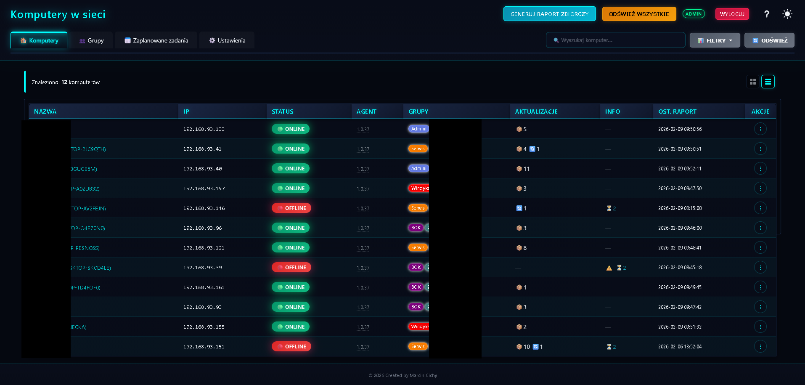
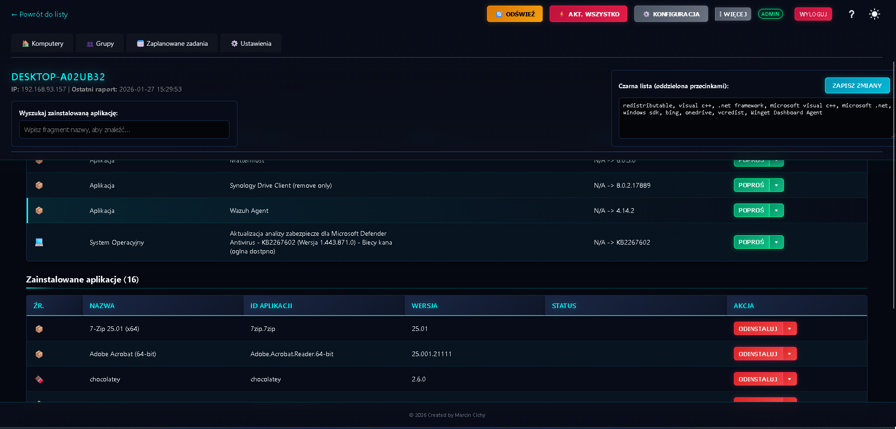
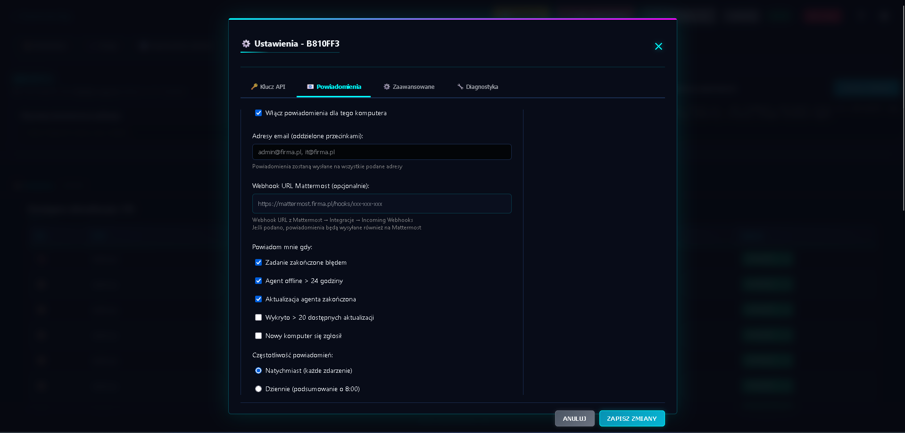
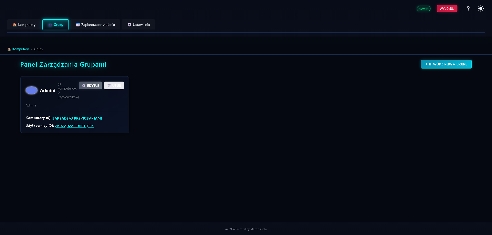
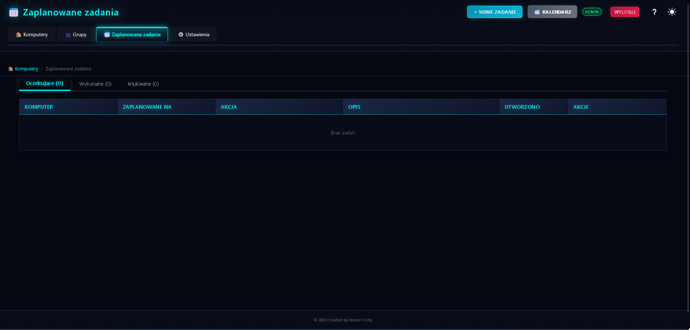
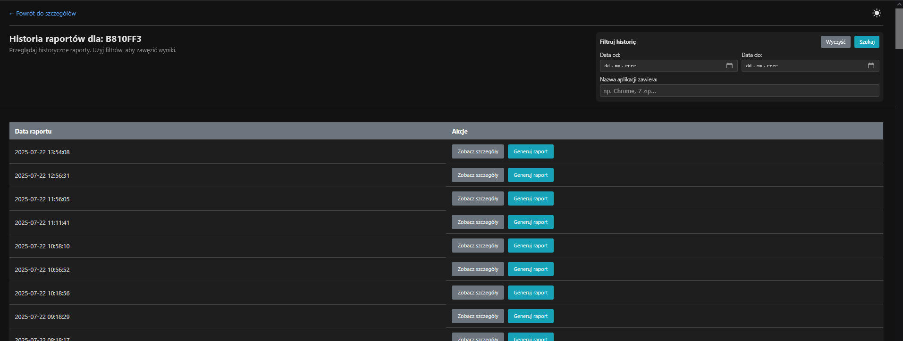
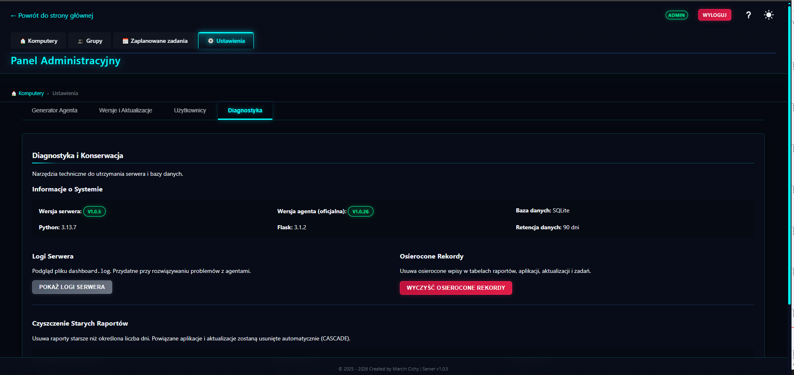
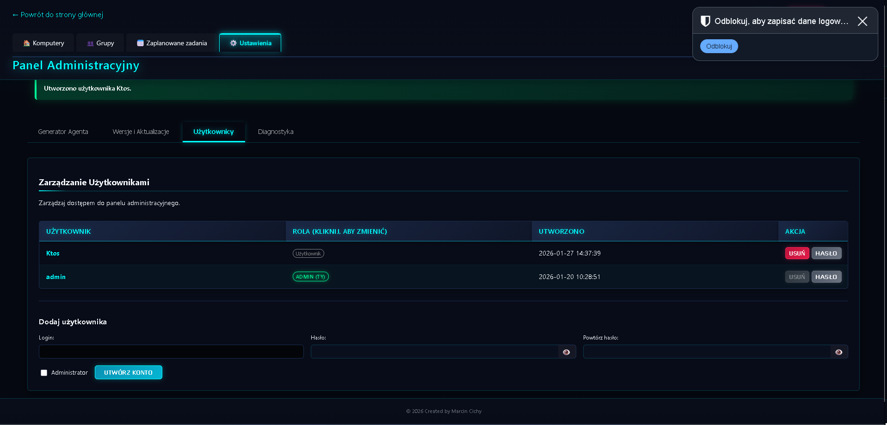
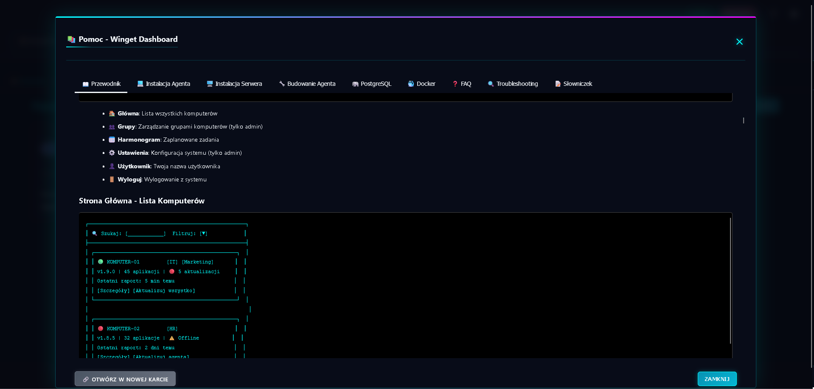

# Winget Dashboard - Centralne Zarządzanie Oprogramowaniem


### Spis Treści (PL)
* [Opis](#opis)
* [Główne Funkcje](#główne-funkcje)
* [Architektura](#architektura)
* [Struktura Projektu](#struktura-projektu)
* [Zrzuty Ekranu](#zrzuty-ekranu)
* [Instalacja i Konfiguracja](#instalacja-i-konfiguracja)
    * [Krok 1: Wymagania](#krok-1-wymagania)
    * [Krok 2: Konfiguracja Serwera](#krok-2-konfiguracja-serwera)
    * [Krok 3: Budowanie Pakietu Agenta (Lokalnie)](#krok-3-budowanie-pakietu-agenta-lokalnie)
    * [Krok 4: Wgranie Pakietu `.zip` na Serwer](#krok-4-wgranie-pakietu-zip-na-serwer)
    * [Krok 5: Stworzenie Instalatora `setup.exe`](#krok-5-stworzenie-instalatora-setupexe)
    * [Krok 6: Wdrożenie na Komputerach Klienckich](#krok-6-wdrożenie-na-komputerach-klienckich)
* [Stos Technologiczny](#stos-technologiczny)

---

### Contents (EN)
* [English Version](#english-version)
    * [Description](#description)
    * [Key Features](#key-features)
    * [Architecture](#architecture-1)
    * [Project Structure](#project-structure)
    * [Screenshots](#screenshots)
    * [Installation and Setup](#installation-and-setup)
        * [Step 1: Prerequisites](#step-1-prerequisites)
        * [Step 2: Server Setup](#step-2-server-setup)
        * [Step 3: Building the Agent Package (Locally)](#step-3-building-the-agent-package-locally)
        * [Step 4: Uploading the `.zip` Package to the Server](#step-4-uploading-the-zip-package-to-the-server)
        * [Step 5: Creating the `setup.exe` Installer](#step-5-creating-the-setupexe-installer)
        * [Step 6: Deploying to Client Machines](#step-6-deploying-to-client-machines)
    * [Technology Stack](#technology-stack)

---

## (PL)

## Opis

**Winget Dashboard** to aplikacja webowa oparta na frameworku Flask, przeznaczona do zdalnego monitorowania i zarządzania oprogramowaniem na komputerach z systemem Windows przy użyciu menedżerów pakietów `winget` oraz `chocolatey`. Projekt został stworzony z myślą o małych i średnich zespołach IT, które potrzebują prostego, scentralizowanego narzędzia do automatyzacji aktualizacji, deinstalacji i raportowania stanu stacji roboczych.

## Główne Funkcje

### 🛡️ Niezawodność i Bezpieczeństwo
* **Health Check & Automatic Rollback:** Agent po każdej własnej aktualizacji przeprowadza autotest ("health check"). Jeśli nowa wersja jest wadliwa, system **automatycznie przywróci poprzednią, stabilną wersję agenta**.
* **Inteligentne Zarządzanie Zadaniami:** Serwer automatycznie wykrywa i zamyka przestarzałe lub "zawieszone" zadania aktualizacji (np. gdy aplikacja została już zaktualizowana ręcznie).
* **Per-Agent API Keys:** Każdy agent posiada własny, unikalny klucz API zamiast jednego wspólnego. Kompromitacja jednego klucza nie naraża całej infrastruktury.
* **Solidna Usługa Windows:** Główny agent działa jako stabilna usługa systemowa (konto `SYSTEM`), odporna na wylogowanie użytkownika.
* **Lokalne Budowanie Agenta:** Ze względów bezpieczeństwa, serwer nie kompiluje kodu agenta. Zamiast tego, udostępnia `builder_helper.exe`, który administrator uruchamia na własnej maszynie, aby lokalnie zbudować i spersonalizować pakiet agenta.

### ⚙️ Zdalne Zarządzanie i Automatyzacja
* **Centralny Panel:** Przegląd wszystkich podłączonych komputerów wraz z ich kluczowymi statusami (online/offline, wymagany restart, wersja agenta, liczba dostępnych aktualizacji).
* **Dwa tryby widoku:** Przełączanie między widokiem kafelków a widokiem tabeli z sortowaniem po dowolnej kolumnie. Preferencja zapamiętywana w przeglądarce.
* **Zdalne Akcje:** Możliwość zdalnego zlecania zadań:
    * **Aktualizacja:** pojedynczych aplikacji lub całego systemu operacyjnego.
    * **Deinstalacja:** dowolnej aplikacji wykrytej przez `winget` lub `chocolatey`.
    * **Aktualizacja Zbiorcza:** Zlecenie wszystkich dostępnych aktualizacji (aplikacji i systemu) jednym kliknięciem.
    * **Bulk Update OS:** Jednoczesna aktualizacja systemu operacyjnego na wszystkich komputerach z poziomu strony głównej.
* **Tryb "Poproś" vs "Wymuś":** Zadania mogą być wykonywane w trybie interaktywnym (z prośbą o zgodę użytkownika na pulpicie) lub w pełni cichym (wymuszonym).
* **Automatyczna Aktualizacja Agenta:** Możliwość zdalnego wdrożenia nowej wersji agenta na wszystkich podłączonych komputerach za pomocą jednego kliknięcia.
* **Zaplanowane Zadania:** Definiowanie zadań cyklicznych (np. cotygodniowa aktualizacja wszystkich aplikacji) z harmonogramem CRON. Zadania wykonywane są automatycznie bez interwencji administratora.

### 👥 Grupy i Organizacja
* **Grupy Komputerów:** Organizowanie komputerów w logiczne grupy (np. "Biuro", "Serwery", "Dział IT"). Możliwość wykonywania akcji zbiorczych na całej grupie.
* **Niestandardowe Nazwy:** Każdemu komputerowi można nadać własną, przyjazną nazwę wyświetlaną (niezależną od nazwy hosta Windows).
* **Zarządzanie Użytkownikami:** System kont z różnymi poziomami dostępu.

### 📊 Diagnostyka i Raportowanie
* **Szczegółowy Widok Komputera:** Dostęp do listy zainstalowanych aplikacji, dostępnych aktualizacji oraz oczekujących aktualizacji systemu Windows.
* **Czarna Lista (Blacklist):** Możliwość zdefiniowania globalnej lub indywidualnej dla komputera listy słów kluczowych (np. "redistributable", "visual c++"), aby ignorować określone aplikacje.
* **Historia Raportów:** Dostęp do historycznych raportów dla każdej maszyny z możliwością filtrowania.
* **Tooltips zadań:** Najeżdżając na badge z liczbą zadań widać ich listę bez otwierania widoku szczegółowego.
* **Zdalna Diagnostyka Agenta:** Dostępne z panelu komputera:
    * **Pokaż Logi:** Pobiera i wyświetla aktualne pliki `agent.log`, `ui_helper.log` i `updater.log` z klienta.
    * **Wyczyść Logi:** Zleca zdalne usunięcie plików logów na kliencie.
    * **Napraw Winget:** Zleca wykonanie polecenia `winget source reset --force` na kliencie.
* **Diagnostyka Serwera:** Możliwość podglądu i czyszczenia pliku `dashboard.log` serwera bezpośrednio z panelu Ustawień.
* **Powiadomienia Email:** Opcjonalne powiadomienia e-mail o zdarzeniach (np. komputer offline, nowe aktualizacje).

## Architektura

System składa się z centralnego serwera oraz czterech komponentów klienckich, które zapewniają jego niezawodne działanie.

1.  **Serwer (Flask):** Sercem aplikacji jest serwer napisany w Pythonie (Flask + Waitress). Odpowiada za udostępnianie panelu webowego, API do komunikacji z agentami oraz zarządzanie bazą danych (SQLite). Warstwa dostępu do danych opiera się na wzorcu **Repository** z fasadami, co zapewnia czytelny podział odpowiedzialności.
2.  **Agent (agent.exe):** Główny program działający jako usługa systemowa Windows (`Windows Service`, konto `SYSTEM`) na komputerach klienckich. Jego zadania to cykliczne raportowanie, pobieranie i koordynowanie zadań oraz uruchamianie Pomocnika UI. Logika komend zrealizowana jest wzorcem **Command Pattern**.
3.  **Pomocnik UI (ui_helper.exe):** Lekki program pośredniczący, uruchamiany automatycznie (przez agenta, przez Harmonogram Zadań z flagą `/ru "NT AUTHORITY\INTERACTIVE"`) w kontekście **zalogowanego użytkownika**. Jest niezbędny, aby ominąć tzw. "Session 0 Isolation", co pozwala agentowi (działającemu jako `SYSTEM`) na uruchamianie poleceń `winget`/`chocolatey` (wymagających kontekstu użytkownika) i wyświetlanie okien dialogowych na pulpicie użytkownika.
4.  **Updater (updater.exe):** Specjalistyczne narzędzie odpowiedzialne za proces autoaktualizacji agenta. Implementuje logikę tworzenia kopii zapasowych, podmiany plików oraz automatycznego rollbacku w razie awarii.
5.  **Pomocnik Budowania (builder_helper.exe):** Program `.exe` uruchamiany przez administratora na jego stacji roboczej (Windows). Nasłuchuje na `localhost:61950` i na żądanie z panelu webowego kompiluje kod źródłowy Pythona przy użyciu lokalnie zainstalowanego PyInstallera. Wynikiem jest spersonalizowany pakiet `.zip` zawierający gotowe pliki `agent.exe`, `ui_helper.exe` i `updater.exe`.

## Struktura Projektu

```plaintext
winget_agent_new/
├── agent_builds/               # Katalog na serwerze do przechowywania pakietów .zip
│
├── builder_helper/             # Kod źródłowy builder_helper.exe
│   └── agent_src/              # Kod źródłowy agenta (commands/, orchestrator.py, ...)
│
├── setup/                      # Katalog używany na maszynie admina do budowy instalatora
│   ├── SourceFiles/            # Pliki źródłowe dla Inno Setup (.exe)
│   ├── Output/                 # Gotowy instalator (.exe)
│   └── setup_script.iss        # Skrypt Inno Setup
│
├── winget_dashboard/           # Główny pakiet aplikacji serwera Flask
│   ├── api/                    # Endpointy API (/api/*)
│   ├── repositories/           # Warstwa dostępu do danych (wzorzec Repository)
│   │   ├── computer.py         # Fasada dla operacji na komputerach
│   │   ├── computer_basic.py   # Podstawowe operacje CRUD
│   │   ├── computer_queries.py # Zapytania i filtrowanie
│   │   ├── computer_groups.py  # Operacje na grupach komputerów
│   │   ├── task.py             # Zarządzanie zadaniami
│   │   ├── group.py            # Zarządzanie grupami
│   │   ├── scheduled_task.py   # Zaplanowane zadania
│   │   └── ...                 # Pozostałe repozytoria
│   ├── services/               # Logika biznesowa serwera
│   ├── static/                 # Pliki statyczne (CSS, JS)
│   ├── templates/              # Szablony HTML (Jinja2)
│   ├── help/                   # Pliki dokumentacji pomocy
│   ├── config.py               # Konfiguracja aplikacji
│   ├── db.py                   # Inicjalizacja bazy danych
│   └── schema.sql              # Schemat bazy danych SQLite
│
├── tests/                      # Testy automatyczne
│   ├── repositories/           # Testy jednostkowe warstwy danych
│   ├── api/                    # Testy API
│   ├── services/               # Testy serwisów
│   └── e2e/                    # Testy end-to-end (Selenium)
│
├── screenshots/                # Zrzuty ekranu do dokumentacji
├── requirements.txt            # Zależności Pythona dla serwera
├── requirements-windows.txt    # Zależności do budowania .exe
├── run.py                      # Skrypt uruchamiający serwer
└── .env                        # Konfiguracja serwera (klucze API itp.)
```

## Zrzuty Ekranu

| Widok | Opis |
|-------|------|
|  | Strona główna — widok kafelków z sortowaniem |
|  | Strona główna — widok tabeli z sortowaniem kolumn |
|  | Szczegółowy widok komputera |
|  | Ustawienia i konfiguracja komputera |
|  | Zarządzanie grupami komputerów |
|  | Harmonogram zadań cyklicznych |
|  | Historia raportów |
|  | Ustawienia serwera |
|  | Zarządzanie użytkownikami |
|  | Wbudowana dokumentacja pomocy |

## Instalacja i Konfiguracja

Proces instalacji składa się z konfiguracji serwera, jednorazowego zbudowania komponentów klienckich za pomocą `builder_helper.exe`, a następnie stworzenia instalatora `setup.exe` do masowej dystrybucji.

### Krok 1: Wymagania

* **Serwer (Linux/Windows):**
    * Python 3.8+
    * Git
* **Maszyna Administratora (Windows):**
    * Python 3.8+
    * Git
    * Zainstalowane pakiety Pythona: `pip install pyinstaller pywin32 requests` (najlepiej w dedykowanym venv)
    * **Inno Setup 6:** Niezbędne do skompilowania skryptu `setup_script.iss` w finalny instalator `.exe`. Pobierz z [jrsoftware.org](https://jrsoftware.org/isinfo.php).

### Krok 2: Konfiguracja Serwera

1.  **Klonuj repozytorium** na serwerze.
    ```bash
    git clone <adres-repozytorium>
    cd winget_agent_new
    ```
2.  **Utwórz i aktywuj wirtualne środowisko**
    ```bash
    python -m venv venv
    # Windows: .\venv\Scripts\activate | Linux: source venv/bin/activate
    ```
3.  **Zainstaluj zależności**
    ```bash
    pip install -r requirements.txt
    ```
4.  **Utwórz plik `.env`** w głównym folderze i uzupełnij go:
    ```ini
    SECRET_KEY=twoj_super_tajny_klucz_sesji
    API_KEY=twoj_super_tajny_klucz_api_dla_agentow
    RATELIMIT_ENABLED=true
    NOTIFICATIONS_ENABLED=false
    ```
5.  **Zainicjuj bazę danych** (tylko raz):
    ```bash
    flask --app run init-db
    ```
6.  **Uruchom serwer produkcyjny:**
    ```bash
    waitress-serve --host=0.0.0.0 --port=5000 winget_dashboard:create_app
    ```

### Krok 3: Budowanie Pakietu Agenta (Lokalnie)

Ten krok wykonujesz **na swojej stacji roboczej administratora** (nie na serwerze).

1.  **Klonuj repozytorium** na swoją stację roboczą.
2.  **Zbuduj `builder_helper.exe`:**
    ```bash
    python -m venv venv-build
    .\venv-build\Scripts\activate
    pip install -r requirements-windows.txt
    pyinstaller --onefile --name builder_helper builder_helper.py
    ```
3.  Gotowy plik `builder_helper.exe` znajdziesz w folderze `dist/`. **Uruchom go.**
    * Nasłuchuje na `http://127.0.0.1:61950`. Nie zamykaj tego okna.
4.  **Użyj Generatora w Panelu Web:**
    * Otwórz panel Winget Dashboard **w przeglądarce na tej samej maszynie**, na której uruchomiłeś `builder_helper.exe`.
    * Przejdź do `Ustawienia` → "Generator Agenta".
    * Podaj wersję, adres serwera i klucz API, kliknij "Generuj Pakiet".
    * Po zakończeniu pobierz spersonalizowany pakiet `.zip`.

### Krok 4: Wgranie Pakietu `.zip` na Serwer

1.  W panelu webowym, w `Ustawienia`, przejdź do sekcji "Wgraj Nowy Pakiet Agenta".
2.  Wskaż pobrany plik `.zip` i kliknij "Wgraj i ustaw nową wersję".
3.  Serwer zapisze plik i oznaczy go jako `_latest`. Ta wersja będzie używana do zdalnych aktualizacji.

### Krok 5: Stworzenie Instalatora `setup.exe`

1.  Rozpakuj pobrany `.zip` i skopiuj `agent.exe`, `ui_helper.exe`, `updater.exe` do folderu `setup/SourceFiles/`.
2.  Otwórz `setup/setup_script.iss` w **Inno Setup 6**.
3.  Zaktualizuj numer wersji na górze skryptu i skompiluj (F9).
4.  Gotowy instalator znajdziesz w `setup/Output/`.

### Krok 6: Wdrożenie na Komputerach Klienckich

1.  Wdróż `setup.exe` na komputerach klienckich i uruchom **jako administrator**.
    * Obsługuje cichą instalację: `/VERYSILENT /SUPPRESSMSGBOXES`
2.  Instalator automatycznie wyczyści stare wersje, zainstaluje nową usługę i ją uruchomi.
3.  Komputer po chwili pojawi się w panelu Winget Dashboard.

## Stos Technologiczny

* **Backend:** Python 3, Flask, Waitress, SQLite
* **Frontend:** HTML5, CSS3, JavaScript (vanilla)
* **Agent:** Python 3, pywin32, requests
* **Menedżery pakietów:** winget, chocolatey
* **Narzędzia Budowania:** PyInstaller, Inno Setup 6
* **Testy:** pytest, Selenium (E2E)

---

## English Version

### Description

**Winget Dashboard** is a Flask-based web application for remotely monitoring and managing software on Windows computers using the `winget` and `chocolatey` package managers. The project is designed for small to medium-sized IT teams who need a simple, centralized tool to automate updates, uninstalls, and reporting for their workstations.

### Key Features

#### 🛡️ Reliability and Security
* **Health Check & Automatic Rollback:** After every self-update, the agent performs a health check. If the new version is faulty, the system **automatically rolls back to the previous, stable version**.
* **Intelligent Task Management:** The server automatically detects and closes obsolete or "stuck" update tasks.
* **Per-Agent API Keys:** Each agent has its own unique API key. Compromising one key does not expose the entire infrastructure.
* **Robust Windows Service:** The main agent runs as a stable Windows service (`SYSTEM` account), resilient to user logouts.
* **Local Agent Building:** For security reasons, the server does not compile agent code. The administrator runs `builder_helper.exe` on their own machine to locally build and personalize the agent package.

#### ⚙️ Remote Management and Automation
* **Central Dashboard:** An overview of all connected computers with their key statuses (online/offline, reboot required, agent version, available update count).
* **Two View Modes:** Toggle between tile view and table view with column sorting. Preference is stored in the browser.
* **Remote Actions:**
    * **Update:** single applications or the entire OS.
    * **Uninstall:** any application detected by `winget` or `chocolatey`.
    * **Update All:** queue all pending application and OS updates with one click.
    * **Bulk OS Update:** trigger OS updates on all computers simultaneously from the main page.
* **"Request" vs. "Force" Mode:** Tasks can be executed interactively (with a user consent dialog) or completely silently.
* **Agent Self-Update:** Remotely deploy a new agent version to all connected machines with one click.
* **Scheduled Tasks:** Define recurring tasks (e.g., weekly update of all applications) with a CRON schedule. Tasks execute automatically without administrator intervention.

#### 👥 Groups and Organization
* **Computer Groups:** Organize computers into logical groups (e.g., "Office", "Servers", "IT Dept"). Perform bulk actions on entire groups.
* **Custom Display Names:** Assign a friendly display name to each computer, independent of the Windows hostname.
* **User Management:** Multi-account system with different access levels.

#### 📊 Diagnostics and Reporting
* **Detailed Computer View:** List of installed applications, available software updates, and pending Windows Updates.
* **Blacklist:** Define a global or per-computer list of keywords (e.g., "redistributable", "visual c++") to ignore specific applications.
* **Report History:** Access historical reports for each machine with filtering.
* **Task Tooltips:** Hovering over the task count badge shows the task list without opening the detail view.
* **Remote Agent Diagnostics:** Available from the computer detail panel:
    * **Show Logs:** Fetches and displays `agent.log`, `ui_helper.log`, and `updater.log` from the client.
    * **Clear Logs:** Triggers remote deletion of log files on the client.
    * **Repair Winget:** Triggers `winget source reset --force` on the client.
* **Server Diagnostics:** View and clear the server's `dashboard.log` directly from the Settings panel.
* **Email Notifications:** Optional email notifications for events (e.g., computer offline, new updates available).

### Architecture

1.  **Server (Flask):** The core is a Python server (Flask + Waitress). It serves the web panel, provides an API for agents, and manages the SQLite database. The data access layer uses the **Repository Pattern** with facades for clean separation of concerns.
2.  **Agent (agent.exe):** The main program running as a Windows Service (`SYSTEM` account) on client machines. Periodic reporting, task coordination, and UI Helper launching. Command logic is implemented using the **Command Pattern**.
3.  **UI Helper (ui_helper.exe):** A lightweight intermediary, launched automatically in the **logged-in user's context** via Task Scheduler (`/ru "NT AUTHORITY\INTERACTIVE"`). Essential for bypassing "Session 0 Isolation" to run `winget`/`chocolatey` commands and display desktop dialogs.
4.  **Updater (updater.exe):** Handles the agent's self-update process — backup creation, file replacement, and automatic rollback on failure.
5.  **Build Helper (builder_helper.exe):** An `.exe` run by the administrator on their Windows workstation. Listens on `localhost:61950` and compiles agent source code via PyInstaller on demand, producing a personalized `.zip` package.

### Project Structure

```plaintext
winget_agent_new/
├── agent_builds/               # Server directory for .zip packages
├── builder_helper/             # builder_helper.exe source code
│   └── agent_src/              # Agent source (commands/, orchestrator.py, ...)
├── setup/                      # Admin machine directory for installer building
│   ├── SourceFiles/            # Inno Setup source files (.exe binaries)
│   ├── Output/                 # Final installer output
│   └── setup_script.iss        # Inno Setup script
├── winget_dashboard/           # Main Flask application package
│   ├── api/                    # API endpoints (/api/*)
│   ├── repositories/           # Data access layer (Repository Pattern)
│   ├── services/               # Business logic
│   ├── static/                 # CSS, JS
│   ├── templates/              # HTML templates (Jinja2)
│   ├── help/                   # Built-in help documentation
│   └── schema.sql              # SQLite schema
├── tests/                      # Automated tests
│   ├── repositories/           # Unit tests
│   ├── api/                    # API tests
│   ├── services/               # Service tests
│   └── e2e/                    # End-to-end tests (Selenium)
├── requirements.txt            # Server Python dependencies
├── requirements-windows.txt    # Build dependencies (.exe)
├── run.py                      # Server startup script
└── .env                        # Server configuration (API keys, etc.)
```

### Screenshots

| View | Description |
|------|-------------|
|  | Main page — tile view with sorting |
|  | Main page — table view with column sorting |
|  | Detailed computer view |
|  | Computer settings |
|  | Computer group management |
|  | Scheduled recurring tasks |
|  | Report history |
|  | Server settings |
|  | User management |
|  | Built-in help documentation |

### Installation and Setup

#### Step 1: Prerequisites

* **Server (Linux/Windows):**
    * Python 3.8+
    * Git
* **Admin Workstation (Windows):**
    * Python 3.8+
    * Git
    * `pip install pyinstaller pywin32 requests` (preferably in a dedicated venv)
    * **Inno Setup 6:** Download from [jrsoftware.org](https://jrsoftware.org/isinfo.php).

#### Step 2: Server Setup

1.  **Clone the repository** on your server.
    ```bash
    git clone <repository-address>
    cd winget_agent_new
    ```
2.  **Create and activate a virtual environment**
    ```bash
    python -m venv venv
    # Windows: .\venv\Scripts\activate | Linux: source venv/bin/activate
    ```
3.  **Install dependencies**
    ```bash
    pip install -r requirements.txt
    ```
4.  **Create a `.env` file** and fill it in:
    ```ini
    SECRET_KEY=your_secret_session_key
    API_KEY=your_secret_api_key_for_agents
    RATELIMIT_ENABLED=true
    NOTIFICATIONS_ENABLED=false
    ```
5.  **Initialize the database** (only once):
    ```bash
    flask --app run init-db
    ```
6.  **Run the production server:**
    ```bash
    waitress-serve --host=0.0.0.0 --port=5000 winget_dashboard:create_app
    ```

#### Step 3: Building the Agent Package (Locally)

Perform this step **on your administrator workstation** (not the server).

1.  **Clone the repository** onto your workstation.
2.  **Build `builder_helper.exe`:**
    ```bash
    python -m venv venv-build
    .\venv-build\Scripts\activate
    pip install -r requirements-windows.txt
    pyinstaller --onefile --name builder_helper builder_helper.py
    ```
3.  The finished `builder_helper.exe` will be in `dist/`. **Run it.** It listens on `http://127.0.0.1:61950`.
4.  **Use the Generator in the Web Panel:**
    * Open the Winget Dashboard panel **in a browser on the same machine**.
    * Go to `Settings` → "Agent Generator".
    * Enter the version, server address, and API key, then click "Generate Package".
    * Download the personalized `.zip` package when finished.

#### Step 4: Uploading the `.zip` Package to the Server

1.  In the web panel under `Settings`, go to "Upload New Agent Package".
2.  Select the `.zip` file and click "Upload and Set New Version".
3.  The server stores the file and marks it as `_latest` for remote updates.

#### Step 5: Creating the `setup.exe` Installer

1.  Unzip the package and copy `agent.exe`, `ui_helper.exe`, `updater.exe` to `setup/SourceFiles/`.
2.  Open `setup/setup_script.iss` in **Inno Setup 6**.
3.  Update the version number at the top and compile (F9).
4.  The installer will be in `setup/Output/`.

#### Step 6: Deploying to Client Machines

1.  Deploy the `setup.exe` and **run it as an administrator**.
    * Silent installation supported: `/VERYSILENT /SUPPRESSMSGBOXES`
2.  The installer will clean up old versions, install the new service, and start it.
3.  The computer will appear in the Winget Dashboard panel shortly.

### Technology Stack

* **Backend:** Python 3, Flask, Waitress, SQLite
* **Frontend:** HTML5, CSS3, JavaScript (vanilla)
* **Agent:** Python 3, pywin32, requests
* **Package Managers:** winget, chocolatey
* **Build Tools:** PyInstaller, Inno Setup 6
* **Testing:** pytest, Selenium (E2E)
