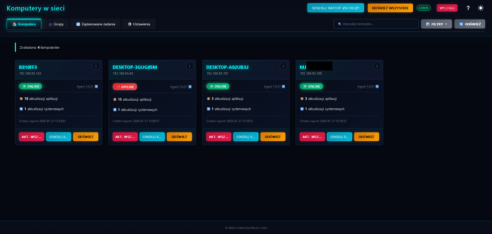

# Winget Dashboard - Centralne Zarządzanie Oprogramowaniem



### Spis Treści (PL)
* [Opis](#opis)
* [Główne Funkcje](#główne-funkcje)
* [Architektura](#architektura)
* [Struktura Projektu](#struktura-projektu)
* [Instalacja i Konfiguracja (Nowa Wersja)](#instalacja-i-konfiguracja-nowa-wersja)
    * [Krok 1: Wymagania](#krok-1-wymagania)
    * [Krok 2: Konfiguracja Serwera](#krok-2-konfiguracja-serwera)
    * [Krok 3: Budowanie Pakietu Agenta (Lokalnie)](#krok-3-budowanie-pakietu-agenta-lokalnie)
    * [Krok 4: Wgranie Pakietu `.zip` na Serwer](#krok-4-wgranie-pakietu-zip-na-serwer)
    * [Krok 5: Stworzenie Instalatora `setup.exe`](#krok-5-stworzenie-instalatora-setupexe)
    * [Krok 6: Wdrożenie na Komputerach Klienckich](#krok-6-wdrożenie-na-komputerach-klienckich)
* [Stos Technologiczny](#stos-technologiczny)

---

### Contents (EN)
* [English Version](#english-version)
    * [Description](#description)
    * [Key Features](#key-features)
    * [Architecture](#architecture)
    * [Project Structure](#project-structure)
    * [Installation and Setup (New Version)](#installation-and-setup-new-version)
        * [Step 1: Prerequisites](#step-1-prerequisites)
        * [Step 2: Server Setup](#step-2-server-setup)
        * [Step 3: Building the Agent Package (Locally)](#step-3-building-the-agent-package-locally)
        * [Step 4: Uploading the `.zip` Package to the Server](#step-4-uploading-the-zip-package-to-the-server)
        * [Step 5: Creating the `setup.exe` Installer](#step-5-creating-the-setupexe-installer)
        * [Step 6: Deploying to Client Machines](#step-6-deploying-to-client-machines)
    * [Technology Stack](#technology-stack)

---

## (PL)

## Opis

**Winget Dashboard** to aplikacja webowa oparta na frameworku Flask, przeznaczona do zdalnego monitorowania i zarządzania oprogramowaniem na komputerach z systemem Windows przy użyciu menedżera pakietów `winget`. Projekt został stworzony z myślą o małych i średnich zespołach IT, które potrzebują prostego, scentralizowanego narzędzia do automatyzacji aktualizacji, deinstalacji i raportowania stanu stacji roboczych.

## Główne Funkcje

### 🛡️ Niezawodność i Bezpieczeństwo
* **Health Check & Automatic Rollback:** Agent po każdej własnej aktualizacji przeprowadza autotest ("health check"). Jeśli nowa wersja jest wadliwa, system **automatycznie przywróci poprzednią, stabilną wersję agenta**.
* **Inteligentne Zarządzanie Zadaniami:** Serwer automatycznie wykrywa i zamyka przestarzałe lub "zawieszone" zadania aktualizacji (np. gdy aplikacja została już zaktualizowana ręcznie).
* **Solidna Usługa Windows:** Główny agent działa jako stabilna usługa systemowa (konto `SYSTEM`), odporna na wylogowanie użytkownika.
* **Lokalne Budowanie Agenta:** Ze względów bezpieczeństwa, serwer nie kompiluje kodu agenta. Zamiast tego, udostępnia `builder_helper.exe`, który administrator uruchamia na własnej maszynie, aby lokalnie zbudować i spersonalizować pakiet agenta.

### ⚙️ Zdalne Zarządzanie i Automatyzacja
* **Centralny Panel:** Przegląd wszystkich podłączonych komputerów wraz z ich kluczowymi statusami (online/offline, wymagany restart, wersja agenta, liczba dostępnych aktualizacji).
* **Zdalne Akcje:** Możliwość zdalnego zlecania zadań:
    * **Aktualizacja:** pojedynczych aplikacji lub całego systemu operacyjnego.
    * **Deinstalacja:** dowolnej aplikacji wykrytej przez `winget`.
    * **Aktualizacja Zbiorcza:** Zlecenie wszystkich dostępnych aktualizacji (aplikacji i systemu) jednym kliknięciem.
* **Tryb "Poproś" vs "Wymuś":** Zadania mogą być wykonywane w trybie interaktywnym (z prośbą o zgodę użytkownika na pulpicie) lub w pełni cichym (wymuszonym).
* **Automatyczna Aktualizacja Agenta:** Możliwość zdalnego wdrożenia nowej wersji agenta na wszystkich podłączonych komputerach za pomocą jednego kliknięcia (po uprzednim wgraniu pakietu `.zip` do panelu).

### 📊 Diagnostyka i Raportowanie
* **Szczegółowy Widok Komputera:** Dostęp do listy zainstalowanych aplikacji, dostępnych aktualizacji oraz oczekujących aktualizacji systemu Windows.
* **Czarna Lista (Blacklist):** Możliwość zdefiniowania globalnej lub indywidualnej dla komputera listy słów kluczowych (np. "redistributable", "visual c++"), aby ignorować określone aplikacje.
* **Historia Raportów:** Dostęp do historycznych raportów dla każdej maszyny z możliwością filtrowania.
* **Zdalna Diagnostyka Agenta:** Dostępne z panelu komputera:
    * **Pokaż Logi:** Pobiera i wyświetla aktualne pliki `agent.log`, `ui_helper.log` i `updater.log` z klienta.
    * **Wyczyść Logi:** Zleca zdalne usunięcie plików logów na kliencie.
    * **Napraw Winget:** Zleca wykonanie polecenia `winget source reset --force` na kliencie.
* **Diagnostyka Serwera:** Możliwość podglądu i czyszczenia pliku `dashboard.log` serwera bezpośrednio z panelu Ustawień.

## Architektura

System składa się z centralnego serwera oraz czterech komponentów klienckich, które zapewniają jego niezawodne działanie.

1.  **Serwer (Flask):** Sercem aplikacji jest serwer napisany w Pythonie (Flask + Waitress). Odpowiada za udostępnianie panelu webowego, API do komunikacji z agentami oraz zarządzanie bazą danych (SQLite).
2.  **Agent (agent.exe):** Główny program działający jako usługa systemowa Windows (`Windows Service`, konto `SYSTEM`) na komputerach klienckich. Jego zadania to cykliczne raportowanie, pobieranie i koordynowanie zadań oraz uruchamianie Pomocnika UI.
3.  **Pomocnik UI (ui_helper.exe):** Lekki program pośredniczący, uruchamiany automatycznie (przez agenta, przez Harmonogram Zadań z flagą `/ru "NT AUTHORITY\INTERACTIVE"`) w kontekście **zalogowanego użytkownika**. Jest niezbędny, aby ominąć tzw. "Session 0 Isolation", co pozwala agentowi (działającemu jako `SYSTEM`) na uruchamianie poleceń `winget` (wymagających kontekstu użytkownika) i wyświetlanie okien dialogowych na pulpicie użytkownika.
4.  **Updater (updater.exe):** Specjalistyczne narzędzie odpowiedzialne za proces autoaktualizacji agenta. Implementuje logikę tworzenia kopii zapasowych, podmiany plików oraz automatycznego rollbacku w razie awarii. Uruchamiany jest przez agenta w kontekście `SYSTEM`, ale potrafi poprawnie zlecić uruchomienie nowego `ui_helper.exe` w sesji użytkownika.
5.  **Pomocnik Budowania (builder_helper.exe):** Program `.exe` uruchamiany przez administratora na jego stacji roboczej (Windows). Nasłuchuje na `localhost:61950` i na żądanie z panelu webowego (otwartego w przeglądarce na tej samej maszynie) kompiluje kod źródłowy Pythona (`agent.py.template`, `ui_helper.py`, `updater.py`) przy użyciu lokalnie zainstalowanego PyInstallera. Wynikiem jest spersonalizowany pakiet `.zip` zawierający gotowe pliki `agent.exe`, `ui_helper.exe` i `updater.exe`.

## Struktura Projektu

Zrozumienie struktury plików jest kluczowe do poprawnego budowania i wdrażania agenta.

```plaintext
/winget-dashboard_new/
├── agent_builds/               # Katalog na serwerze do przechowywania pakietów .zip
│   ├── WingetAgent_vX.Y.Z.zip  # (Tu wgrywasz gotowe pakiety .zip przez panel)
│   └── WingetAgent_latest.zip  # (Symlink/kopia najnowszej wgranej wersji)
│
├── setup/                      # Katalog używany na maszynie admina do budowy instalatora
│   ├── SourceFiles/            # Katalog źródłowy dla Inno Setup
│   │   ├── agent.exe           # (Tu kopiujesz pliki .exe z pobranego .zip)
│   │   ├── ui_helper.exe
│   │   └── updater.exe
│   ├── Output/                 # Katalog wyjściowy dla Inno Setup
│   │   └── WingetDashboardAgent_Setup_vX.Y.Z.exe # (Gotowy instalator)
│   └── setup.iss               # (Skrypt Inno Setup do budowy instalatora)
│
├── winget_dashboard/           # Główny pakiet aplikacji serwera Flask
│   ├── static/                 # Pliki statyczne (CSS, JS)
│   ├── templates/              # Szablony HTML (Jinja2)
│   ├── api/                    # Endpointy API
│   ├── services/               # Logika biznesowa serwera
│   ├── __init__.py             # (Główny kod serwera Flask)
│   └── ...                     # (Inne moduły Pythona)
│
├── agent.py.template           # (Szablon kodu źródłowego agenta.exe)
├── ui_helper.py                # (Kod źródłowy pomocnika ui_helper.exe)
├── updater.py                  # (Kod źródłowy aktualizatora updater.exe)
├── builder_helper.py           # (Kod źródłowy pomocnika budowania builder_helper.exe)
├── requirements.txt            # Zależności Pythona dla serwera
├── requirements-windows.txt    # Zależności Pythona potrzebne do budowania .exe
├── run.py                      # Skrypt do uruchamiania serwera
└── .env                        # Plik konfiguracyjny serwera (klucze API itp.)
```

## Instalacja i Konfiguracja (Nowa Wersja)

Proces instalacji składa się z konfiguracji serwera, jednorazowego zbudowania komponentów klienckich za pomocą `builder_helper.exe`, a następnie stworzenia instalatora `setup.exe` do masowej dystrybucji.

### Krok 1: Wymagania

* **Serwer (Linux/Windows):**
    * Python 3.8+
    * Git
* **Maszyna Administratora (Windows):**
    * Python 3.8+
    * Git
    * Zainstalowane pakiety Pythona: `pip install pyinstaller pywin32 requests` (najlepiej w dedykowanym venv)
    * **Inno Setup 6:** Niezbędne do skompilowania skryptu `setup.iss` w finalny instalator `.exe`. Pobierz z [jrsoftware.org](https://jrsoftware.org/isinfo.php).

### Krok 2: Konfiguracja Serwera

1.  **Klonuj repozytorium** na serwerze.
    ```bash
    git clone <adres-repozytorium>
    cd winget-dashboard_new
    ```
2.  **Utwórz i aktywuj wirtualne środowisko**
    ```bash
    python -m venv venv
    # Windows: .\venv\Scripts\activate | Linux: source venv/bin/activate
    ```
3.  **Zainstaluj zależności**
    ```bash
    pip install -r requirements.txt
    ```
4.  **Utwórz plik `.env`** w głównym folderze (`winget-dashboard_new/`) i uzupełnij go:
    ```ini
    # Wygeneruj silny, losowy klucz. Możesz użyć: python -c "import secrets; print(secrets.token_hex(16))"
    SECRET_KEY=twoj_super_tajny_klucz_sesji

    # Wygeneruj losowy klucz API, który będzie używany do autoryzacji agentów
    API_KEY=twoj_super_tajny_klucz_api_dla_agentow
    ```
5.  **Zainicjuj bazę danych** (tylko raz):
    ```bash
    # Upewnij się, że venv jest aktywne
    flask --app run init-db
    ```
6.  **Uruchom serwer produkcyjny:**
    ```bash
    waitress-serve --host=0.0.0.0 --port=5000 winget_dashboard:create_app
    ```
    Serwer jest gotowy i działa na porcie 5000. Zanotuj jego adres IP lub nazwę domenową.

### Krok 3: Budowanie Pakietu Agenta (Lokalnie)

Ten krok wykonujesz **na swojej stacji roboczej administratora** (nie na serwerze), aby bezpiecznie skompilować kod agenta.

1.  **Klonuj repozytorium** na swoją stację roboczą (tę samą, na której masz Pythona, PyInstallera i Inno Setup).
2.  **Zbuduj `builder_helper.exe`:**
    * Otwórz terminal (CMD lub PowerShell) w folderze `winget-dashboard_new/`.
    * Jeśli nie masz venv, utwórz je: `python -m venv venv-build`
    * Aktywuj venv: `.\venv-build\Scripts\activate`
    * Zainstaluj wymagania: `pip install -r requirements-windows.txt`
    * Skompiluj pomocnika: `pyinstaller --onefile --name builder_helper builder_helper.py`
3.  Gotowy plik `builder_helper.exe` znajdziesz w folderze `dist/`. **Uruchom go.**
    * Pomocnik uruchomi się w konsoli, nasłuchując na `http://127.0.0.1:61950`. Nie zamykaj tego okna.
    * Zapora Windows może zapytać o zgodę – zezwól na dostęp (tylko dla sieci prywatnych).
4.  **Użyj Generatora w Panelu Web:**
    * Otwórz panel Winget Dashboard (np. `http://adres-ip-serwera:5000`) **w przeglądarce na tej samej maszynie**, na której uruchomiłeś `builder_helper.exe`.
    * Przejdź do `Ustawienia`.
    * Wypełnij formularz "Generator Agenta":
        * **Wersja:** Wpisz numer wersji (np. `1.8.5`).
        * **Adres serwera:** Podaj **publiczny adres serwera** (ten z Kroku 2.6), np. `http://192.168.1.100:5000`.
        * **Klucz API:** Wklej klucz API z pliku `.env` serwera.
        * Pozostałe pola zazwyczaj można zostawić domyślne.
    * Kliknij "Generuj Pakiet".
    * Panel webowy wyśle żądanie do Twojego lokalnego `builder_helper.exe`. Kompilacja może potrwać kilka minut. Status będzie widoczny w sekcji "Status Budowania".
    * Po zakończeniu pojawi się link "Pobierz Gotowy Pakiet (.zip)". Kliknij go, aby pobrać spersonalizowany pakiet (np. `WingetAgent_v1.8.5.zip`).
    * Możesz teraz zamknąć `builder_helper.exe` (Ctrl+C w konsoli).

### Krok 4: Wgranie Pakietu `.zip` na Serwer

Po zbudowaniu pakietu `.zip` w Kroku 3, musisz go wgrać na serwer, aby był dostępny dla zdalnych aktualizacji agentów.

1.  W panelu webowym, w `Ustawienia`, przejdź do sekcji "Krok 1: Wgraj Nowy Pakiet Agenta".
2.  Kliknij "Wybierz pakiet" i wskaż pobrany plik `.zip` (np. `WingetAgent_v1.8.5.zip`). Wersja powinna się automatycznie wypełnić.
3.  Kliknij "Wgraj i ustaw nową wersję".
4.  Serwer zapisze plik w folderze `agent_builds/` (na serwerze) i oznaczy go jako `_latest`. Od teraz ta wersja będzie używana do zdalnych aktualizacji.

### Krok 5: Stworzenie Instalatora `setup.exe`

Teraz, gdy masz gotowy, spersonalizowany pakiet `.zip`, możesz stworzyć instalator `setup.exe` do masowej dystrybucji na stacjach klienckich.

1.  **Na swojej stacji roboczej administratora:**
    * Rozpakuj pobrany plik `.zip` (np. `WingetAgent_v1.8.5.zip`).
    * Skopiuj trzy pliki (`agent.exe`, `ui_helper.exe`, `updater.exe`) z rozpakowanego archiwum do folderu `setup/SourceFiles/` w swoim lokalnym repozytorium (`winget-dashboard_new/setup/SourceFiles/`).
2.  Otwórz plik `setup/setup.iss` za pomocą **Inno Setup 6**.
3.  Na górze skryptu, **zaktualizuj wersję**, aby pasowała do wersji zbudowanego pakietu:
    ```islu
    #define AppVersion "1.8.5" // <-- Zmień na aktualną wersję
    ```
4.  W Inno Setup kliknij menu "Build" -> "Compile" (lub naciśnij F9).
5.  Gotowy instalator (np. `WingetDashboardAgent_Setup_v1.8.5.exe`) znajdziesz w folderze `setup/Output/`.

### Krok 6: Wdrożenie na Komputerach Klienckich

1.  Weź gotowy plik `setup.exe` z Kroku 5.
2.  Wdróż go na komputerach klienckich i **uruchom jako administrator**.
    * Możesz to zrobić ręcznie, przez GPO, PDQ Deploy, PSExec lub dowolne inne narzędzie do dystrybucji oprogramowania. Instalator obsługuje cichą instalację (parametry `/VERYSILENT /SUPPRESSMSGBOXES`).
3.  Instalator automatycznie wyczyści stare wersje (jeśli istniały), zainstaluje nową usługę i ją uruchomi.
4.  Komputer po chwili powinien pojawić się w panelu Winget Dashboard.

## Stos Technologiczny

* **Backend:** Python 3, Flask, Waitress, SQLite
* **Frontend:** HTML5, CSS3, JavaScript (bez frameworków)
* **Agent:** Python 3, pywin32, requests
* **Narzędzia Budowania:** PyInstaller, Inno Setup 6

---

## English Version

### Description

**Winget Dashboard** is a Flask-based web application for remotely monitoring and managing software on Windows computers using the `winget` package manager. The project is designed for small to medium-sized IT teams who need a simple, centralized tool to automate updates, uninstalls, and reporting for their workstations.

### Key Features

#### 🛡️ Reliability and Security
* **Health Check & Automatic Rollback:** After every self-update, the agent performs a health check. If the new version is faulty, the system **automatically rolls back to the previous, stable version**.
* **Intelligent Task Management:** The server automatically detects and closes obsolete or "stuck" update tasks (e.g., if an app was already updated manually).
* **Robust Windows Service:** The main agent runs as a stable Windows service (using the `SYSTEM` account), resilient to user logouts.
* **Local Agent Building:** For security reasons, the server does not compile agent code. Instead, it provides a `builder_helper.exe` that the administrator runs on their own machine to locally build and personalize the agent package.

#### ⚙️ Remote Management and Automation
* **Central Dashboard:** An overview of all connected computers with their key statuses (online/offline, reboot required, agent version, number of available updates).
* **Remote Actions:** Ability to remotely trigger tasks:
    * **Update:** for single applications or the entire operating system.
    * **Uninstall:** for any application detected by `winget`.
    * **Update All:** Queue all pending application and OS updates with one click.
* **"Request" vs. "Force" Mode:** Tasks can be executed interactively (with a user consent dialog) or completely silently (forced).
* **Agent Self-Update:** Ability to remotely deploy a new version of the agent to all connected machines with a single click (after uploading the `.zip` package to the panel).

#### 📊 Diagnostics and Reporting
* **Detailed Computer View:** Access to the list of installed applications, available software updates, and pending Windows Updates.
* **Blacklist:** Define a global or per-computer list of keywords (e.g., "redistributable", "visual c++") to ignore specific applications.
* **Report History:** Access historical reports for each machine with filtering capabilities.
* **Remote Agent Diagnostics:** Available from the computer's detail panel:
    * **Show Logs:** Fetches and displays the current `agent.log`, `ui_helper.log`, and `updater.log` from the client.
    * **Clear Logs:** Triggers a remote deletion of log files on the client.
    * **Repair Winget:** Triggers a `winget source reset --force` command on the client.
* **Server Diagnostics:** Ability to view and clear the server's `dashboard.log` file directly from the Settings panel.

### Architecture

The system consists of a central server and four client components that ensure its reliable operation.

1.  **Server (Flask):** The core of the application is a Python server (Flask + Waitress). It serves the web panel, provides an API for agents, and manages the database (SQLite).
2.  **Agent (agent.exe):** The main program running as a Windows Service (`SYSTEM` account) on client computers. Its tasks include periodically reporting, fetching and coordinating tasks, and launching the UI Helper.
3.  **UI Helper (ui_helper.exe):** A lightweight intermediary program, launched automatically (by the agent, via Scheduled Tasks with `/ru "NT AUTHORITY\INTERACTIVE"`) in the **logged-in user's context**. It is essential to bypass "Session 0 Isolation," allowing the `SYSTEM` agent to execute `winget` commands (which require user context) and display dialogs on the user's desktop.
4.  **Updater (updater.exe):** A specialized tool responsible for the agent's self-update process. It implements the logic for creating backups, replacing files, and performing an automatic rollback. It runs as `SYSTEM` but correctly schedules the new `ui_helper.exe` to run in the user's session.
5.  **Build Helper (builder_helper.exe):** An `.exe` program run by the administrator on their workstation (Windows). It listens on `localhost:61950` and, upon request from the web panel (opened in a browser on the same machine), compiles the Python source code (`agent.py.template`, `ui_helper.py`, `updater.py`) using the locally installed PyInstaller. The result is a personalized `.zip` package containing the ready-to-deploy `agent.exe`, `ui_helper.exe`, and `updater.exe` files.

```plaintext

/winget-dashboard_new/
├── agent_builds/               # Directory on the server to store .zip packages
│   ├── WingetAgent_vX.Y.Z.zip  # (You upload finished .zip packages here via the panel)
│   └── WingetAgent_latest.zip  # (Symlink/copy of the latest uploaded version)
│
├── setup/                      # Directory used on the admin machine for installer building
│   ├── SourceFiles/            # Source directory for Inno Setup
│   │   ├── agent.exe           # (You copy .exe files from the downloaded .zip here)
│   │   ├── ui_helper.exe
│   │   └── updater.exe
│   ├── Output/                 # Output directory for Inno Setup
│   │   └── WingetDashboardAgent_Setup_vX.Y.Z.exe # (Final installer)
│   └── setup.iss               # (Inno Setup script to build the installer)
│
├── winget_dashboard/           # Main Flask application package
│   ├── static/                 # Static files (CSS, JS)
│   ├── templates/              # HTML templates (Jinja2)
│   ├── api/                    # API endpoints
│   ├── services/               # Server business logic
│   ├── __init__.py             # (Main Flask server code)
│   └── ...                     # (Other Python modules)
│
├── agent.py.template           # (Source code template for agent.exe)
├── ui_helper.py                # (Source code for ui_helper.exe)
├── updater.py                  # (Source code for updater.exe)
├── builder_helper.py           # (Source code for builder_helper.exe)
├── requirements.txt            # Python dependencies for the server
├── requirements-windows.txt    # Python dependencies needed for building .exe files
├── run.py                      # Script to run the server
└── .env                        # Server configuration file (API keys, etc.)
```

### Installation and Setup (New Version)

The installation process involves setting up the server, building the client components once using `builder_helper.exe`, and then creating a `setup.exe` installer for mass distribution.

#### Step 1: Prerequisites

* **Server (Linux/Windows):**
    * Python 3.8+
    * Git
* **Admin Workstation (Windows):**
    * Python 3.8+
    * Git
    * Installed Python packages: `pip install pyinstaller pywin32 requests` (preferably in a dedicated venv)
    * **Inno Setup 6:** Required to compile the `setup.iss` script into a final `.exe` installer. Download from [jrsoftware.org](https://jrsoftware.org/isinfo.php).

#### Step 2: Server Setup

1.  **Clone the repository** on your server.
    ```bash
    git clone <repository-address>
    cd winget-dashboard_new
    ```
2.  **Create and activate a virtual environment**
    ```bash
    python -m venv venv
    # Windows: .\venv\Scripts\activate | Linux: source venv/bin/activate
    ```
3.  **Install dependencies**
    ```bash
    pip install -r requirements.txt
    ```
4.  **Create a `.env` file** in the root folder (`winget-dashboard_new/`) and fill it:
    ```ini
    # Generate a strong, random key. You can use: python -c "import secrets; print(secrets.token_hex(16))"
    SECRET_KEY=your_super_secret_session_key

    # Generate a random API key that will be used to authorize agents
    API_KEY=your_super_secret_api_key_for_agents
    ```
5.  **Initialize the database** (only once):
    ```bash
    # Ensure venv is active
    flask --app run init-db
    ```
6.  **Run the production server:**
    ```bash
    waitress-serve --host=0.0.0.0 --port=5000 winget_dashboard:create_app
    ```
    The server is now ready and running on port 5000. Note its IP address or domain name.

#### Step 3: Building the Agent Package (Locally)

You perform this step **on your administrator workstation** (not the server) to securely compile the agent code.

1.  **Clone the repository** onto your workstation (the one with Python, PyInstaller, and Inno Setup).
2.  **Build `builder_helper.exe`:**
    * Open a terminal (CMD or PowerShell) in the `winget-dashboard_new/` folder.
    * If you don't have a venv, create one: `python -m venv venv-build`
    * Activate the venv: `.\venv-build\Scripts\activate`
    * Install requirements: `pip install -r requirements-windows.txt`
    * Compile the helper: `pyinstaller --onefile --name builder_helper builder_helper.py`
3.  The finished `builder_helper.exe` will be in the `dist/` folder. **Run it.**
    * The helper will start in a console, listening on `http://127.0.0.1:61950`. Do not close this window.
    * Windows Firewall may ask for permission; allow it (for private networks only).
4.  **Use the Generator in the Web Panel:**
    * Open the Winget Dashboard panel (e.g., `http://your-server-ip:5000`) **in a browser on the same machine** where you are running `builder_helper.exe`.
    * Go to `Settings`.
    * Fill out the "Agent Generator" form:
        * **Version:** Enter the desired version number (e.g., `1.8.5`).
        * **Server Address:** Provide the **public address of your server** (from Step 2.6), e.g., `http://192.168.1.100:5000`.
        * **API Key:** Paste the API key from the server's `.env` file.
        * Other fields can usually be left default.
    * Click "Generate Package".
    * The web panel will send a request to your local `builder_helper.exe`. Compilation may take a few minutes. The status will be shown in the "Build Status" section.
    * Once finished, a "Download Finished Package (.zip)" link will appear. Click it to download the personalized package (e.g., `WingetAgent_v1.8.5.zip`).
    * You can now close `builder_helper.exe` (Ctrl+C in the console).

#### Step 4: Uploading the `.zip` Package to the Server

After building the `.zip` package in Step 3, you must upload it to the server to make it available for remote agent updates.

1.  In the web panel, under `Settings`, go to the "Step 1: Upload New Agent Package" section.
2.  Click "Choose Package" and select the `.zip` file you just downloaded (e.g., `WingetAgent_v1.8.5.zip`). The version should auto-fill.
3.  Click "Upload and Set New Version".
4.  The server will store the file in the `agent_builds/` folder (on the server) and mark it as `_latest`. This version will now be used for remote updates.

#### Step 5: Creating the `setup.exe` Installer

Now that you have the ready, personalized `.zip` package, you can create the `setup.exe` installer for mass distribution to client stations.

1.  **On your administrator workstation:**
    * Unzip the downloaded `.zip` package (e.g., `WingetAgent_v1.8.5.zip`).
    * Copy the three files (`agent.exe`, `ui_helper.exe`, `updater.exe`) from the unzipped archive into the `setup/SourceFiles/` folder in your local repository (`winget-dashboard_new/setup/SourceFiles/`).
2.  Open the `setup/setup.iss` file with **Inno Setup 6**.
3.  At the top of the script, **update the version** to match the version of the package you built:
    ```islu
    #define AppVersion "1.8.5" // <-- Change to your current version
    ```
4.  In Inno Setup, click the menu "Build" -> "Compile" (or press F9).
5.  The finished installer (e.g., `WingetDashboardAgent_Setup_v1.8.5.exe`) will be in the `setup/Output/` folder.

#### Step 6: Deploying to Client Machines

1.  Take the `setup.exe` file from Step 5.
2.  Deploy it to your client machines and **run it as an administrator**.
    * You can do this manually, via GPO, PDQ Deploy, PSExec, or any other software distribution tool. The installer supports silent installation (parameters: `/VERYSILENT /SUPPRESSMSGBOXES`).
3.  The installer will automatically clean up old versions (if they existed), install the new service, and start it.
4.  The computer should appear in the Winget Dashboard panel shortly.

### Technology Stack

* **Backend:** Python 3, Flask, Waitress, SQLite
* **Frontend:** HTML5, CSS3, JavaScript (vanilla)
* **Agent:** Python 3, pywin32, requests
* **Build Tools:** PyInstaller, Inno Setup 6